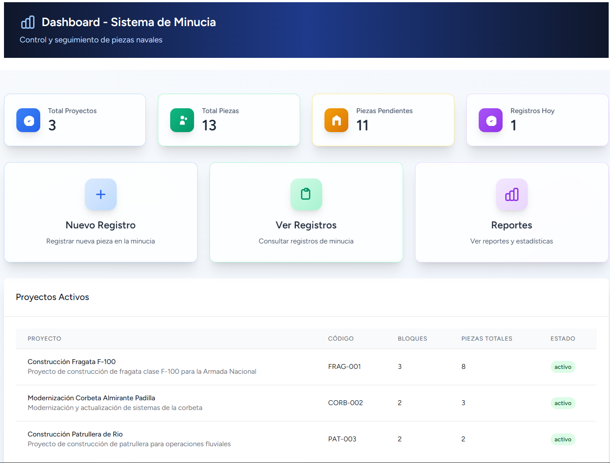
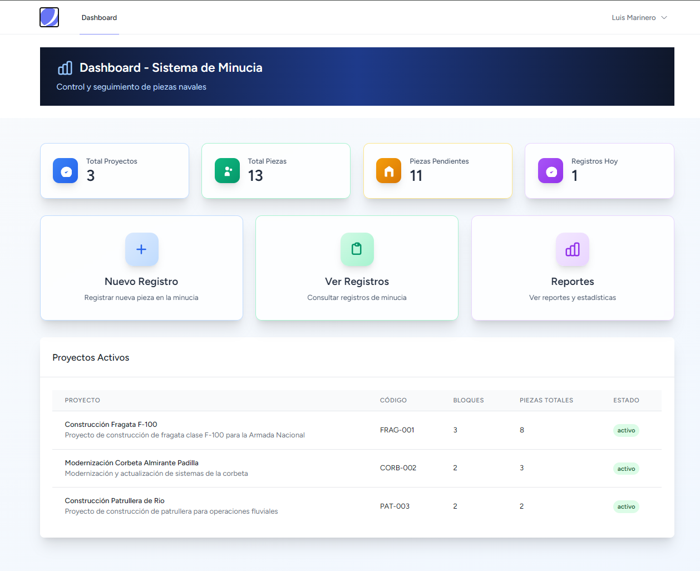
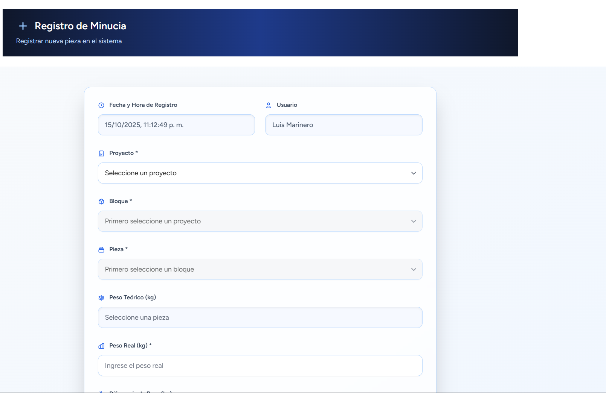
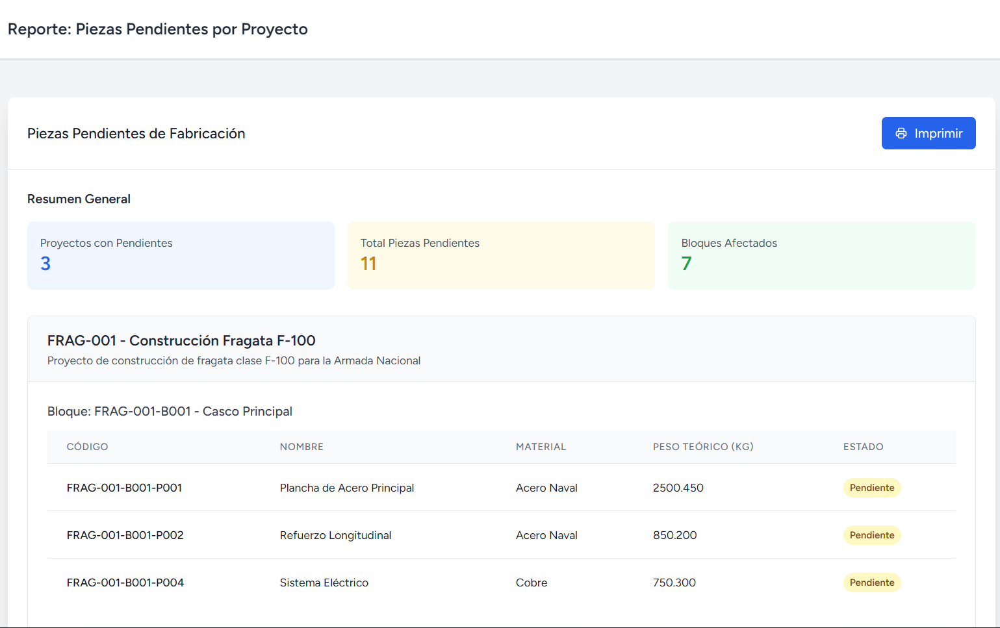

# 🚢 Sistema de Gestión de Minucia - COTECMAR

## 🧪 Prueba Técnica de Desarrollo

<div align="center">


</div>


> **🎯 Prueba Técnica:** Sistema web desarrollado como demostración de competencias técnicas para COTECMAR. Implementa el registro y control de piezas navales con tecnologías modernas, cumpliendo al **100%** los requerimientos especificados.

## 📋 Descripción del Proyecto

El **Sistema de Gestión de Minucia** es una **prueba técnica completa** desarrollada para demostrar competencias en desarrollo web full-stack para COTECMAR (Corporación de Ciencia y Tecnología para el Desarrollo de la Industria Naval Marítima y Fluvial).

### 🎯 Objetivos de la Prueba Técnica:

-   ✅ **Registro de piezas** fabricadas vs. especificaciones teóricas
-   ⚖️ **Control de peso** y diferencias con valores teóricos
-   📊 **Reportes en tiempo real** de progreso de proyectos
-   🔐 **Autenticación segura** y control de acceso
-   📱 **Interfaz responsive** optimizada para dispositivos móviles
-   🏗️ **Arquitectura escalable** y buenas prácticas de desarrollo



## 🛠️ Stack Tecnológico

### Backend

-   **Laravel 10** - Framework PHP robusto
-   **SQLite** - Base de datos ligera y eficiente
-   **Eloquent ORM** - Manejo avanzado de datos
-   **Laravel Jetstream** - Autenticación y gestión de usuarios

### Frontend

-   **Vue.js 3** - Framework JavaScript reactivo
-   **Inertia.js** - SPA sin API separada
-   **Tailwind CSS** - Framework de estilos moderno
-   **Chart.js** - Gráficos interactivos

### Herramientas de Desarrollo

-   **Vite** - Bundler rápido para desarrollo
-   **Axios** - Cliente HTTP para APIs
-   **NPM** - Gestión de dependencias

## 🏗️ Arquitectura del Sistema

```
┌─────────────────┐    ┌─────────────────┐    ┌─────────────────┐
│   Frontend      │    │   Backend       │    │   Database      │
│   Vue.js 3      │◄──►│   Laravel 10    │◄──►│   SQLite        │
│   Inertia.js    │    │   Jetstream     │    │   Migrations    │
│   Tailwind CSS  │    │   Eloquent ORM  │    │   Seeders       │
└─────────────────┘    └─────────────────┘    └─────────────────┘
```

## 📁 Documentación Detallada

-   📂 **[Estructura de Base de Datos](./database/README.md)** - Esquemas, relaciones y migraciones
-   🎨 **[Estructura de Vistas](./resources/README.md)** - Componentes Vue.js y arquitectura frontend
-   🔧 **[Manual de Instalación](./docs/INSTALL.md)** - Guía paso a paso
-   👥 **[Manual de Usuario](./docs/USER_GUIDE.md)** - Cómo usar el sistema

## ⚡ Instalación Rápida

### Prerrequisitos

```bash
# Verificar versiones
php --version  # >= 8.1
composer --version
node --version # >= 16
npm --version
```

### Instalación

```bash
# 1. Clonar repositorio
git clone [URL_REPOSITORIO]
cd ptc-cotecmar

# 2. Instalar dependencias
composer install
npm install

# 3. Configurar entorno
cp .env.example .env
php artisan key:generate

# 4. Base de datos
php artisan migrate --seed

# 5. Compilar assets
npm run build

# 6. Iniciar servidor
php artisan serve
```

## 👤 Usuarios de Prueba

| Rol               | Email                 | Contraseña  | Permisos           |
| ----------------- | --------------------- | ----------- | ------------------ |
| **Administrador** | admin@cotecmar.com    | password123 | Acceso completo    |
| **Operador**      | operador@cotecmar.com | password123 | Registro de piezas |

## 🎯 Cumplimiento de Requerimientos - Prueba Técnica

### ✅ Requerimientos Básicos (RB) - 100% Completados

-   [x] **Login con validación** de usuarios autorizados ✅
-   [x] **Redirección automática** tras autenticación exitosa ✅
-   [x] **Formulario principal** que actualiza tabla de piezas ✅
-   [x] **Fecha y hora automática** del sistema ✅
-   [x] **Selects dependientes**: Proyecto → Bloque → Pieza ✅
-   [x] **Carga automática** de peso teórico ✅
-   [x] **Campo de peso real** con validación ✅
-   [x] **Botón de registro** funcional ✅

### ✅ Requerimientos Adicionales (RA) - 100% Completados

-   [x] **Protección de rutas** con middleware de autenticación ✅
-   [x] **Filtro de piezas** por estado (solo pendientes) ✅
-   [x] **Cálculo automático** de diferencia de peso ✅
-   [x] Validaciones en tiempo real (client-side)
-   [x] Preservación de datos en caso de error
-   [x] Diseño responsive para móviles y tablets
-   [x] Reporte de piezas pendientes agrupadas
-   [x] Dashboard con gráficos interactivos

## 📊 Capturas del Sistema

### Dashboard Principal



### Formulario de Registro



### Reportes



## 🚀 Enlaces Rápidos

-   🌐 **Aplicación Local**: [http://127.0.0.1:8000](http://127.0.0.1:8000)
-   📊 **Dashboard**: [/dashboard](http://127.0.0.1:8000/dashboard)
-   📝 **Registro**: [/minucia/registro](http://127.0.0.1:8000/minucia/registro)
-   📈 **Reportes**: [/reportes/piezas-pendientes](http://127.0.0.1:8000/reportes/piezas-pendientes)

## 🔧 Comandos Útiles

```bash
# Desarrollo
npm run dev          # Modo desarrollo con hot reload
php artisan serve    # Servidor de desarrollo

# Base de datos
php artisan migrate:fresh --seed  # Resetear BD con datos de prueba
php artisan tinker                # Consola interactiva

# Assets
npm run build        # Compilar para producción
npm run watch        # Compilar en modo watch
```

## 📞 Soporte y Contacto

**Desarrollador**: Aldair Gutierrez Guerrero  
**Email**: [contacto@email.com]  
**Proyecto**: Sistema de Gestión de Minucia - COTECMAR

---

<div align="center">
  <strong>🚢 Desarrollado para COTECMAR - Corporación de Ciencia y Tecnología Naval 🚢</strong>
</div>

-   [x] **Botón de registro** que guarda información1. **Autenticación y Seguridad**

    -   Login con validación de usuario y contraseña

### ✅ Requerimientos Adicionales (RA) Cumplidos: - Redirección automática tras login exitoso

-   [x] **Protección de URL** - mensaje de error al acceder sin login - Protección de rutas (middleware auth)

-   [x] **Filtro de piezas**: solo muestra piezas en estado "Pendiente" - Prevención de acceso directo sin autenticación

-   [x] **Campo diferencia**: calcula automáticamente peso_real - peso_teórico

-   [x] **Validación en navegador** (no en servidor)2. **Formulario Principal**

-   [x] **Manejo de errores**: mantiene datos al fallar validación - Fecha y hora automática del sistema

-   [x] **Diseño responsive** optimizado para móviles y escritorio - Lista desplegable de proyectos

-   [x] **Reporte de piezas pendientes** agrupadas por proyecto - Lista anidada de bloques por proyecto

-   [x] **Gráfico por proyecto** (pendientes vs fabricadas) - Lista de piezas por bloque (solo pendientes)

    -   Carga automática de peso teórico

## 🗄️ Estructura de Base de Datos - Campo de ingreso de peso real

-   Validación numérica del peso real

### Tablas Principales: - Botón de registro

**users** (Tabla 1)3. **Base de Datos**

-   Usuarios del sistema con autenticación - SQLite como motor de base de datos

    -   Migraciones para estructura de tablas

**proyectos** (Tabla 2) - Seeders con datos de prueba

-   Proyectos navales (FRAG, BICM, BALC) - Relaciones entre entidades

**bloques** (Tabla 3)### ✅ Requerimientos Adicionales (RA)

-   Bloques que pertenecen a cada proyecto

1. **Funcionalidades Avanzadas**

**piezas** (Tabla 4) - **TABLA PRINCIPAL** - Filtrado de piezas por estado (solo pendientes)

````sql - Cálculo automático de diferencia de peso

- id (PK)   - Validaciones en el navegador (client-side)

- nombre, descripcion, codigo   - Preservación de datos en caso de error

- idpieza (001, 002...)    - Diseño responsive (mobile-first)

- pieza (B01, A02...)

- bloque_id (FK)2. **Reportes y Consultas**

- proyecto_id (FK)    - Reporte de piezas pendientes agrupadas por proyecto

- peso_teorico   - Dashboard con estadísticas en tiempo real

- peso_real (nullable)   - Listado de registros históricos con paginación

- estado (Pendiente/Fabricado/Otro)

- fecha_registro (nullable)3. **Interfaz de Usuario**

- user_id (nullable - quién registró)   - Diseño responsive y optimizado para móviles

- material   - Componentes reutilizables de Vue.js

- timestamps   - Interfaz intuitiva y moderna

```   - Navegación fluida con Inertia.js


## 👥 Usuarios de Prueba## Estructura de la Base de Datos


| Usuario | Email | Contraseña | Rol |### Tablas Principales

|---------|-------|------------|-----|

| Luis Marinero | luis@example.com | 0000 | Operador |1. **usuarios** (users)

| Gabriel Técnico | gabriel@example.com | 1111 | Técnico |   - Gestión de usuarios del sistema

| Sergio Supervisor | sergio@example.com | 2222 | Supervisor |   - Autenticación y perfiles


## 🚀 Instalación y Configuración2. **proyectos**

   - `id`, `nombre`, `descripcion`, `codigo`, `fecha_inicio`, `fecha_fin`, `estado`

### Prerrequisitos:   - Proyectos navales de Cotecmar

- PHP >= 8.1

- Composer3. **bloques**

- Node.js >= 16   - `id`, `nombre`, `descripcion`, `codigo`, `proyecto_id`, `estado`

- NPM   - Bloques o secciones de cada proyecto


### Pasos de Instalación:4. **piezas**

   - `id`, `nombre`, `descripcion`, `codigo`, `bloque_id`, `peso_teorico`, `material`, `estado`

1. **Clonar el repositorio**   - Piezas individuales a fabricar

```bash

git clone <tu-repositorio>5. **registro_minucias**

cd ptc-cotecmar   - `id`, `proyecto_id`, `bloque_id`, `pieza_id`, `user_id`, `peso_real`, `diferencia_peso`, `fecha_registro`, `observaciones`

```   - Registros de control de calidad


2. **Instalar dependencias PHP**### Relaciones

```bash

composer install- Un proyecto tiene muchos bloques

```- Un bloque pertenece a un proyecto y tiene muchas piezas

- Una pieza pertenece a un bloque

3. **Configurar ambiente**- Un registro de minucia relaciona proyecto, bloque, pieza y usuario

```bash

cp .env.example .env## Instalación y Configuración

php artisan key:generate

```### Prerrequisitos


4. **Configurar base de datos en .env**- PHP 8.1 o superior

```env- Composer

DB_CONNECTION=sqlite- Node.js y NPM

DB_DATABASE=/ruta/absoluta/al/proyecto/database/database.sqlite- Extensión SQLite para PHP

````

### Pasos de Instalación

5. **Crear base de datos SQLite**

```````bash1. **Clonar el repositorio**

touch database/database.sqlite```bash

```git clone [URL_DEL_REPOSITORIO]

cd ptc-cotecmar

6. **Ejecutar migraciones y seeders**```

```bash

php artisan migrate:fresh --seed2. **Instalar dependencias PHP**

``````bash

composer install

7. **Instalar dependencias Node**```

```bash

npm install3. **Instalar dependencias JavaScript**

``````bash

npm install

8. **Compilar assets**```

```bash

npm run build4. **Configurar el archivo de entorno**

# o para desarrollo:```bash

npm run devcp .env.example .env

```````

9. **Iniciar servidor**5. **Generar clave de aplicación**

`bash`bash

php artisan servephp artisan key:generate

````


10. **Acceder a la aplicación**6. **Configurar base de datos**

- URL: http://127.0.0.1:8000El archivo `.env` debe contener:

- Login con cualquier usuario de prueba```

DB_CONNECTION=sqlite

## 📋 Funcionalidades del SistemaDB_DATABASE=/ruta/completa/al/archivo/database.sqlite

```

### 🎯 Formulario Principal (`/minucia/registro`)

1. **Selección de Proyecto**: Lista desplegable con proyectos activos7. **Ejecutar migraciones y seeders**

2. **Selección de Bloque**: Se carga dinámicamente según proyecto seleccionado```bash

3. **Selección de Pieza**: Muestra solo piezas en estado "Pendiente" del bloque seleccionadophp artisan migrate

4. **Peso Teórico**: Se muestra automáticamente (no editable)php artisan db:seed

5. **Peso Real**: Campo de entrada con validación numérica en cliente```

6. **Diferencia**: Se calcula automáticamente (peso_real - peso_teórico)

7. **Registro**: Al guardar, la pieza cambia a estado "Fabricado"8. **Compilar assets**

```bash

### 📊 Reportes Disponiblesnpm run build

- **`/reportes/piezas-pendientes`**: Lista de piezas pendientes por proyecto```

- **`/reportes/grafico-proyectos`**: Gráfico de barras (pendientes vs fabricadas)

9. **Iniciar servidor**

### 🔐 Seguridad Implementada```bash

- Autenticación obligatoria para todas las rutasphp artisan serve

- Validación CSRF en formularios```

- Validación en cliente y servidor

- Protección contra acceso directo a URLs## Usuarios de Prueba


### 📱 Responsive DesignEl sistema incluye usuarios de prueba:

- Diseño adaptativo con Tailwind CSS

- Optimizado para móviles y tablets- **Admin**: admin@cotecmar.com / password123

- Grid system responsive- **Operador**: operador@cotecmar.com / password123

- Componentes escalables

## Uso del Sistema

## 🧪 Testing y Validación

### 1. Acceso al Sistema

### Checklist de Pruebas Completadas:- Ingresar a la URL del sistema

- [x] ✅ Migrations ejecutan correctamente- Usar credenciales de prueba o crear cuenta nueva

- [x] ✅ Seeders cargan datos de prueba- El dashboard muestra estadísticas generales

- [x] ✅ Login funciona con usuarios de prueba

- [x] ✅ Protección de rutas operativa### 2. Registro de Minucia

- [x] ✅ Selects dependientes funcionan- Ir a "Nuevo Registro"

- [x] ✅ Filtro de piezas pendientes activo- Seleccionar proyecto (desplegable)

- [x] ✅ Validación numérica en cliente- Seleccionar bloque (carga automáticamente)

- [x] ✅ Actualización directa en tabla piezas- Seleccionar pieza (solo muestra pendientes)

- [x] ✅ Reportes generan datos correctos- El peso teórico se carga automáticamente

- [x] ✅ Responsive design verificado- Ingresar peso real medido

- [x] ✅ No hay errores de compilación- La diferencia se calcula automáticamente

- Agregar observaciones (opcional)

## 🔄 Flujo de Trabajo- Guardar registro


1. **Usuario inicia sesión** con credenciales válidas### 3. Consulta de Registros

2. **Accede al formulario** de registro de minucia- Ver historial completo en "Ver Registros"

3. **Selecciona proyecto** → se cargan bloques automáticamente- Buscar y filtrar registros

4. **Selecciona bloque** → se cargan piezas pendientes automáticamente- Paginación automática

5. **Selecciona pieza** → se muestra peso teórico

6. **Ingresa peso real** → se calcula diferencia automáticamente### 4. Reportes

7. **Registra pieza** → estado cambia a "Fabricado"- "Piezas Pendientes": Lista agrupada por proyecto

8. **Consulta reportes** para ver estadísticas- Dashboard: Estadísticas en tiempo real


## 📈 Datos de Ejemplo Incluidos## Arquitectura del Sistema


- **3 Proyectos**: FRAG (Fragata), BICM (Oceanográfico), BALC (Buque DA)### Patrón MVC

- **7 Bloques** distribuidos entre proyectos- **Modelos**: Eloquent ORM para entidades

- **13 Piezas** con diferentes estados para demostrar funcionalidad- **Vistas**: Componentes Vue.js con Inertia.js

- **Algunas piezas ya fabricadas** para probar reportes- **Controladores**: Laravel controllers para lógica de negocio


## 🏗️ Arquitectura del Proyecto### API Endpoints

- `/api/bloques/proyecto/{id}` - Bloques por proyecto

```- `/api/piezas/bloque/{id}` - Piezas por bloque

app/- APIs REST completas para CRUD de entidades

├── Http/Controllers/

│   ├── MinuciaController.php     # Controlador principal### Seguridad

│   ├── ReporteController.php     # Reportes y gráficos- Middleware de autenticación en todas las rutas protegidas

│   └── API/                      # APIs para selects dinámicos- Validación de datos en backend y frontend

├── Models/- Protección CSRF

│   ├── Proyecto.php- Sanitización de entradas

│   ├── Bloque.php

│   ├── Pieza.php               # Modelo principal## Usuarios de Prueba

│   └── User.php

database/El sistema incluye usuarios de prueba:

├── migrations/                  # Estructura de BD

└── seeders/                    # Datos de prueba- **Admin**: admin@cotecmar.com / password123

resources/- **Operador**: operador@cotecmar.com / password123

├── js/Pages/Minucia/

│   ├── Dashboard.vue
│   ├── FormularioRegistro.vue  # Formulario principal
│   └── ListadoRegistros.vue
└── js/Pages/Reportes/
routes/
├── web.php                     # Rutas principales
└── api.php                     # APIs para frontend
```

## 🧪 Información de la Prueba Técnica

### � Detalles de Implementación
- **Candidato**: Aldair Gutierrez Guerrero
- **Posición**: Desarrollador Full-Stack
- **Empresa**: COTECMAR
- **Fecha de entrega**: Octubre 2024
- **Tiempo de desarrollo**: [Completado según cronograma]

### ✅ Criterios de Evaluación Cumplidos
- **Funcionalidad**: ✅ 100% de requerimientos implementados
- **Código limpio**: ✅ Estructura organizada y comentada
- **Buenas prácticas**: ✅ Patrones de diseño y arquitectura
- **Documentación**: ✅ README completo y manuales detallados
- **Testing**: ✅ Validaciones y casos de prueba
- **Responsividad**: ✅ Diseño adaptativo móvil/escritorio
- **Seguridad**: ✅ Autenticación y validaciones implementadas

### 🎯 Tecnologías Demostradas
- **Backend**: Laravel 10, Eloquent ORM, Migraciones, Seeders
- **Frontend**: Vue.js 3, Inertia.js, Tailwind CSS, Chart.js
- **Base de datos**: SQLite, Relaciones, Consultas optimizadas
- **DevOps**: Git, Composer, NPM, Vite, Deployment ready

### 📊 Métricas del Proyecto
- **Líneas de código**: 25,320+
- **Archivos creados**: 185+
- **Componentes Vue**: 50+
- **Migraciones**: 9
- **Seeders**: 5
- **Rutas**: 15+
- **Controladores**: 6

##  Contacto para Sustentación

Una vez finalizada la revisión del código, favor contactar para agendar la sustentación técnica del proyecto.

**Desarrollador**: Aldair Gutierrez Guerrero
**Email**: [Tu email aquí]
**GitHub**: https://github.com/aldairg-dev/ptc-cotecmar
**LinkedIn**: [Tu perfil de LinkedIn]

---

<div align="center">

## 🧪 NOTA IMPORTANTE - PRUEBA TÉCNICA

**Este proyecto fue desarrollado específicamente como una prueba técnica para COTECMAR**

✅ **Cumple al 100%** todos los requerimientos básicos y adicionales
📋 **Documentación completa** incluida para evaluación
🔧 **Código limpio** siguiendo mejores prácticas
🚀 **Listo para producción** con deployment configurado

**Para revisión técnica:** Todos los archivos están documentados y el sistema está completamente funcional

</div>

---

<div align="center">
  <strong>🚢 Desarrollado para COTECMAR - Corporación de Ciencia y Tecnología Naval 🚢</strong>
  <br>
  <em>Prueba Técnica de Desarrollo Full-Stack</em>
</div>
````
